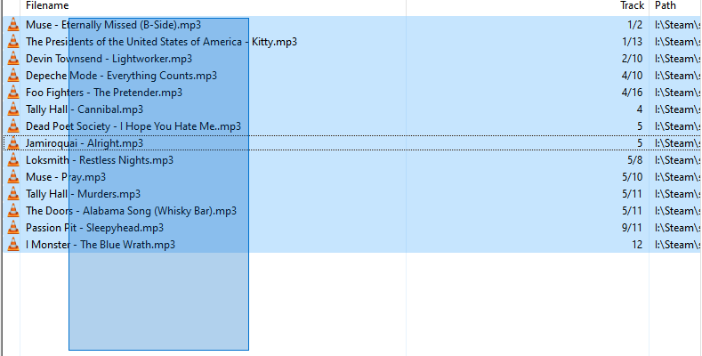
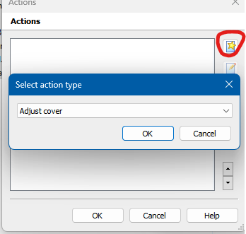
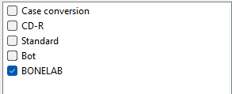

# Custom Audio
Setting up custom audio

## Requirements
* MP3 files
* [Mp3Tag](https://www.mp3tag.de/en/)
## File Setup
* Drag your MP3 files into Mp3Tag
* Select all of them

* Right click and hit "Actions"
* Create a new action and name it anything
* Add an "Adjust cover" action to it

* Set the max size to "336"
* Deselect all action groups EXCEPT the one you just made

* Hit "OK"
## Installation
* Place your MP3 files into `UserData/Weather Electric/MediaPlayer/Custom Music`